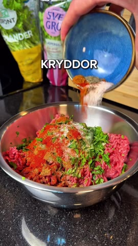

# Arayes

*4 arayes · Källa: [Instagram-reelen](https://www.instagram.com/reel/DMLHJSWIPrP/)*

## Ingredienser

### Köttfyllning
- 500 g nötfärs 10%
- 1 riven gul lök
- 3 pressade vitlöksklyftor
- 1–2 msk finhackad koriander
- 1–2 msk finhackad persilja
- 2 tsk salt, 2 tsk spiskummin, 2 tsk paprikapulver
- 1 tsk svartpeppar, 1 tsk cayennepeppar
- 2 pitabröd

### Yoghurtsås
- 2 stora msk grekisk yoghurt 0%
- 1 msk citronjuice
- 1 tsk koriander, 1 tsk persilja
- Salt och peppar

## Gör så här

### 1. Krydda och blanda färsen

Blanda nötfärs, riven lök, vitlök, örter och kryddor ordentligt.

### 2. Fyll pitabröden

Dela och öppna pitabröden. Fördela fyllningen mellan bröden; originalet delar allt i fyra arayes.

### 3. Stek

Lägg arayesen med köttsidan nedåt på ett grilljärn och stek på båda sidor tills brödet är krispigt och färsen är genomstekt.

### 4. Rör ihop såsen och servera

Rör ihop yoghurten, citronjuicen, örterna, saltet och pepparn. Servera till arayesen.

> Näring enligt originalet: cirka 327 kcal och 29 g protein per arayes.
