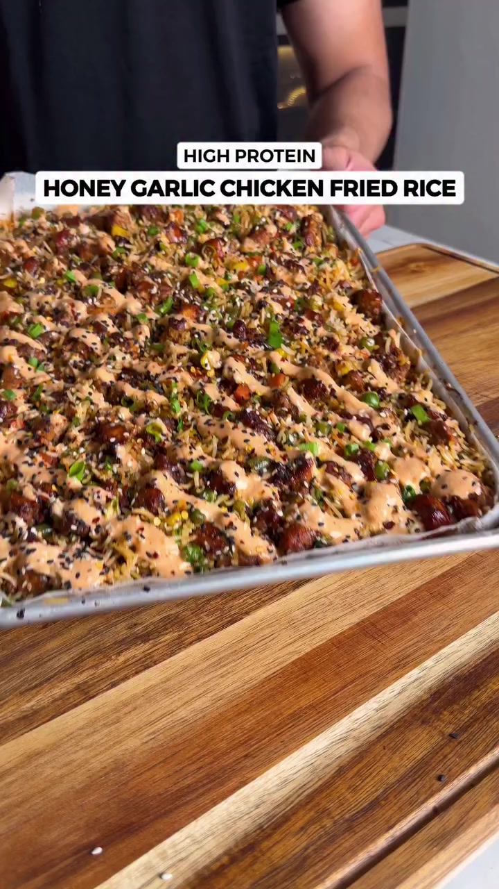
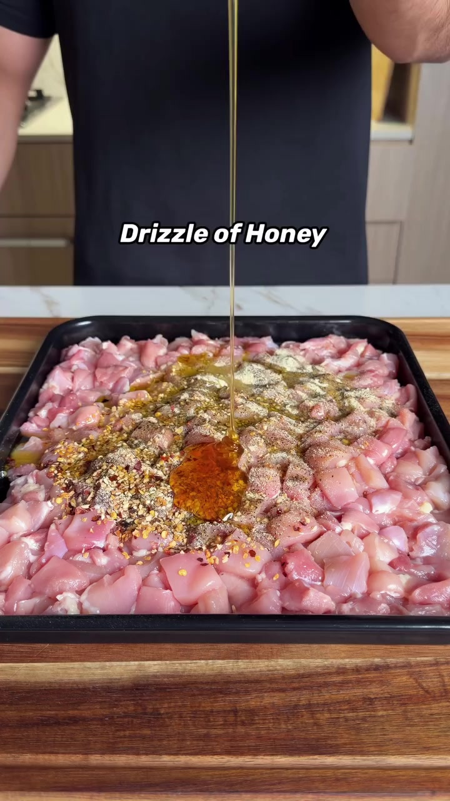
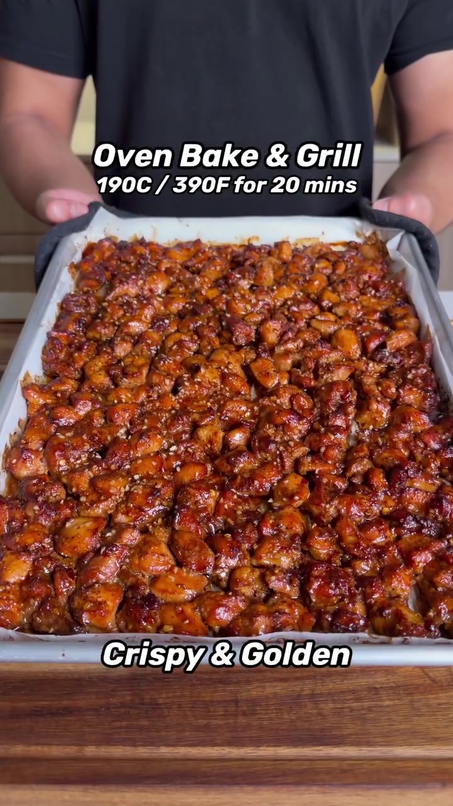
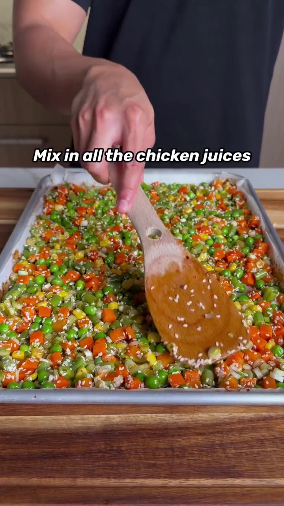
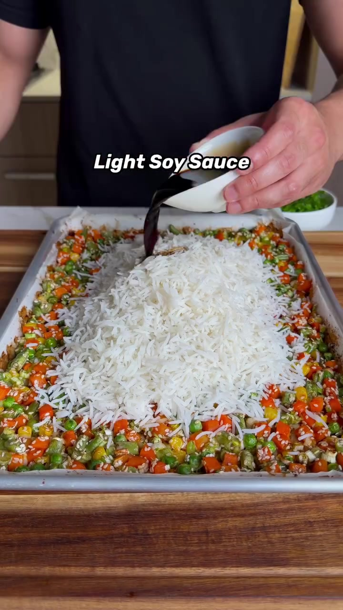

# Krispig honungs- och vitlökskyckling med ugnsstekt ris

*8 portioner · Källa: [Facebook-reelen](https://www.facebook.com/reel/2942235325975801/)*

> Proteinrik matlåda på plåt med krispig honungs- och vitlökskyckling, sesamris och krämig srirachasås.

## Ingredienser

### Honungs- och vitlökskyckling
- 1 300 g benfria kycklinglår, tärnade och putsade
- 2,5 tsk svartpeppar
- 4 tsk vitlöksgranulat
- 3 tsk lökpulver
- 2 tsk chiliflakes
- 6 tsk olivolja
- 50 g honung
- 30 g ljus soja
- 25 g mörk soja

### Krämig srirachasås
- 300 g lätt yoghurt
- 120 g lätt majonnäs
- 50 g sriracha
- 25 g honung
- 1,5 tsk rökt paprikapulver

### Sesamris
- 450–500 g frysta blandade grönsaker
- 100 g vita delen av salladslök
- 40 g sesamfrön
- 350–400 g okokt vitt ris (ca 700–800 g kokt)
- 40 g ljus soja
- 50 g gröna delen av salladslök
- 20 g lätt smör

## Gör så här

### 1. Marinera kycklingen

Skär kycklingen i små tärningar och blanda med svartpeppar, vitlöksgranulat, lökpulver, chiliflakes, olivolja, honung samt ljus och mörk soja.

### 2. Rör ihop såsen

Vispa yoghurt, majonnäs, sriracha, honung och rökt paprikapulver slätt. Ställ kallt.

### 3. Baka kycklingen

Värm ugnen till 190 °C. Lägg kycklingen på en klädd plåt, spreja lätt med matlagningsspray och baka i 20 minuter, tills den är gyllene och krispig.

### 4. Rosta grönsakerna

Ta bort kycklingen men låt stekskyn ligga kvar. Vänd ner frysta grönsaker, vita salladslöksdelar och sesamfrön i skyn. Rosta i 15 minuter.

### 5. Vänd ihop riset

Koka riset enligt anvisningarna. Tillsätt riset, ljus soja, gröna salladslöksdelar och smör till grönsakerna. Vänd försiktigt ihop allt, vänd sedan ner kycklingen och servera med srirachasåsen.

> Näring per portion enligt originalet: 550 kcal, 42 g protein, 52 g kolhydrater och 18 g fett.
