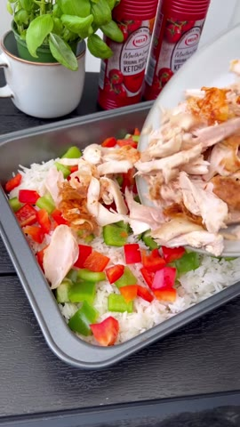
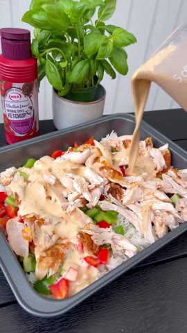

# Krämig grillad kycklinggratäng

**Källa:** [mackanskost på Instagram](https://www.instagram.com/reel/DBDtj5TIO2p/) · Antal portioner anges inte i originalet.

1. Värm ugnen till 225 °C och koka 3 dl ris enligt förpackningen. Dra köttet från en färdiggrillad kyckling och hacka en grön och en röd paprika.

   
   *Ris, paprika och kyckling har fördelats i formen.*

2. Blanda 3 dl matlagningsgrädde, 1 dl crème fraiche, cirka 2 dl Hela curryketchup, salt och peppar. Häll över och rör om lite vid behov.

   
   *Den krämiga curryketchupsåsen hälls över formen.*

3. Strö över 2 dl riven ost. Grädda i 10–15 minuter tills osten har smält och gratängen har fått fin färg.

   
   *Den färdiggräddade gratängen med smält ost.*

4. Servera med sallad.

   
   *En serveringssked tar upp gratängen ur formen.*

> Bilderna är oförändrade bildrutor valda från originalreelen; den portabla Cooklang-filen finns som `krämig-grillad-kycklinggratäng.cook`.