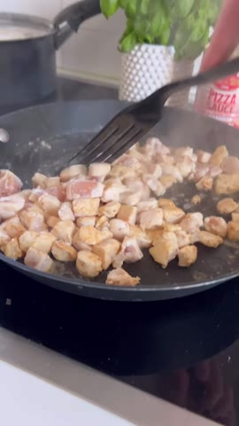
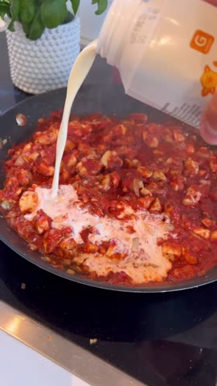
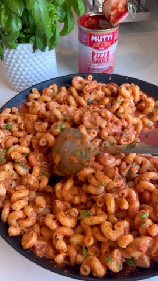
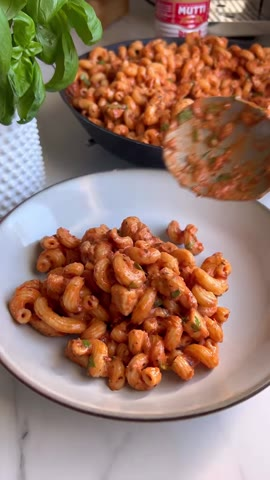

# Krämig pizzapasta

**Källa:** [mackanskost på Instagram](https://www.instagram.com/reel/DBL1OovIjQY/) · Antal portioner anges inte i originalet.

1. Koka 400 g pasta enligt förpackningen. Finhacka 2 gula lökar och strimla 500 g kycklingfilé.

2. Bryn kycklingen i en varm panna. Salta och peppra ordentligt, tillsätt löken och låt den steka med. Krydda rikligt med pizzakrydda.

   
   *Kycklingen bryns i pannan innan såsen tillsätts.*

3. Häll över en burk pizzasås (cirka 400 ml) och 2,5 dl matlagningsgrädde. Smaka av med mer pizzakrydda och låt puttra tills kycklingen är klar.

   
   *Matlagningsgrädde tillsätts till pizzasåsen i pannan.*

4. Vänd ner pastan i såsen. Toppa med riven ost och servera direkt.

   
   *Den kokta pastan vänds runt i såsen.*

   
   *Den färdiga, krämiga pizzapastan.*

> Bilderna är oförändrade bildrutor valda från originalreelen; den portabla Cooklang-filen finns som `krämig-pizzapasta.cook`.