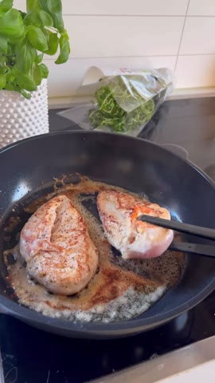
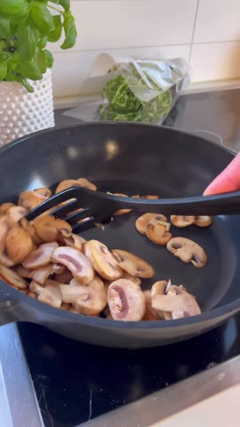
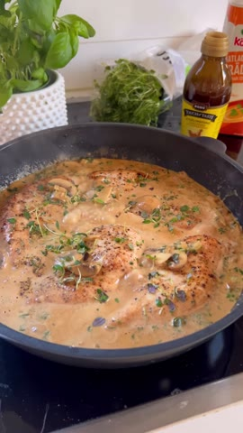
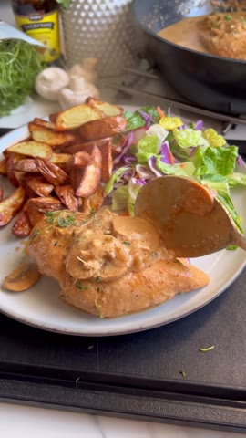

# Kycklingfilé i ljuvlig champinjonsås

**Källa:** [mackanskost på Instagram](https://www.instagram.com/reel/DDpiy23IaRx/) · Antal portioner anges inte i originalet.

1. Finhacka 1 gul lök och 2 vitlöksklyftor. Strimla 250 g champinjoner.

2. Hetta upp smör i en panna och bryn 4 kycklingfiléer. Ta upp dem när de fått fin färg.

   
   *Kycklingfiléerna bryns innan de tas upp ur pannan.*

3. Stek champinjonerna tills de fått yta. Tillsätt lök och vitlök och låt fräsa med.

   
   *Champinjonerna steks tills de har fått yta.*

4. Häll på 3 dl matlagningsgrädde, 2–3 msk kycklingfond, 1 msk kinesisk soja och en halv kruka finhackad timjan. Smaka av med salt och peppar. Lägg tillbaka kycklingen och låt puttra tills den är klar rakt igenom.

   
   *Kycklingen tillagas färdigt i champinjonsåsen.*

5. Servera med krispig potatis och en god sallad.

   
   *Den färdiga rätten serverad med potatis och sallad.*

> Bilderna är oförändrade bildrutor valda från originalreelen; den portabla Cooklang-filen finns som `kycklingfilé-i-champinjonsås.cook`.