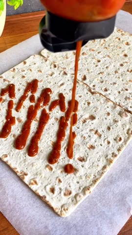
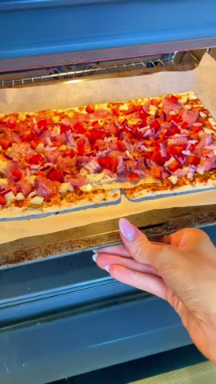

# Pizza-kyckling-rullar

*2 rullar · Källa: [Instagram-reelen](https://www.instagram.com/reel/DKPXYzVMumZ/)*

## Ingredienser
- 2 tunnbröd
- 75 g mager ost
- 200 g fryst kycklingfilé, upptinad, tärnad och avtorkad
- 1 liten paprika
- 1 liten rödlök
- Chilisalt samt oregano eller persilja

### Tomatsås
- 50 g passerade tomater
- 1 pressad vitlöksklyfta
- Oregano, salt och peppar

### Vitlökssås
- 1 dl naturell yoghurt 3%
- 1 pressad vitlöksklyfta
- Salt och peppar

## Gör så här

### 1. Bred på tomatsåsen

Blanda tomatsåsens ingredienser och bred den över bröden.

### 2. Lägg på fyllningen

Toppa med ost, tärnad kyckling, paprika och rödlök. Krydda med chilisalt samt oregano eller persilja och rulla ihop.

### 3. Baka

Baka i 200 °C i cirka 15 minuter. Kontrollera att kycklingen är helt färdig.

### 4. Servera

Rör ihop vitlökssåsen och servera till.

> Näring enligt originalet per rulle: cirka 365 kcal, 8 g fett, 35 g kolhydrater och 38 g protein.
