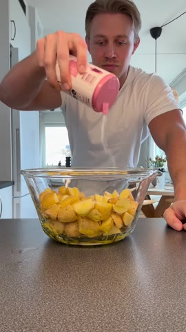
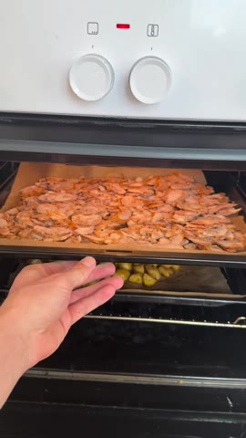
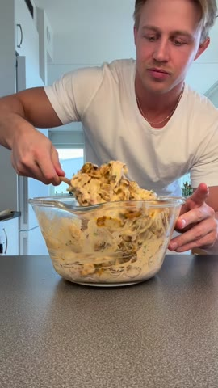

# Potatissallad med kycklingkebab — blockerad

**Källa:** [Instagram-reelen](https://www.instagram.com/reel/DKHZV5dMFS-/)

> **Ingen Cooklang-fil skapad.** Originalets bildtext innehåller inga ingrediensmängder, temperatur eller tid. Videon visar potatis, kycklingkebab, kryddning/dressing och örter, men anger inte tillräckligt för ett troget recept. Inga mängder eller instruktioner har därför hittats på.

## Verifierade videomoment

Potatis kryddas i en skål.

Potatis och kycklingkebab syns på plåtar i ugnen.

Den färdiga potatissalladen serveras.

Se `source/source-caption.txt`, `source/original-reel.mp4` och `contact-sheet.jpg` för källmaterial och granskningsunderlag.
